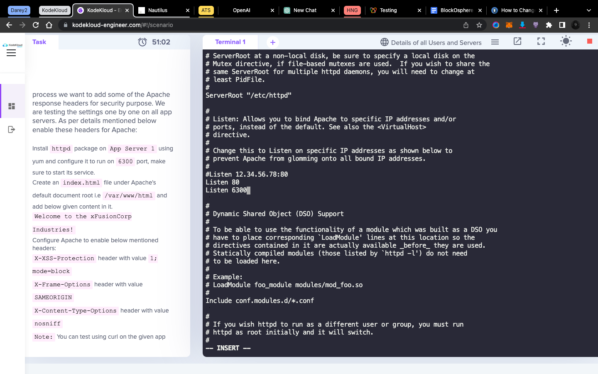
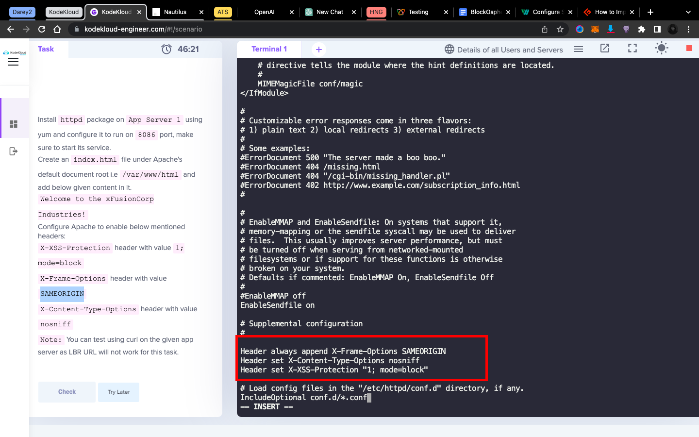
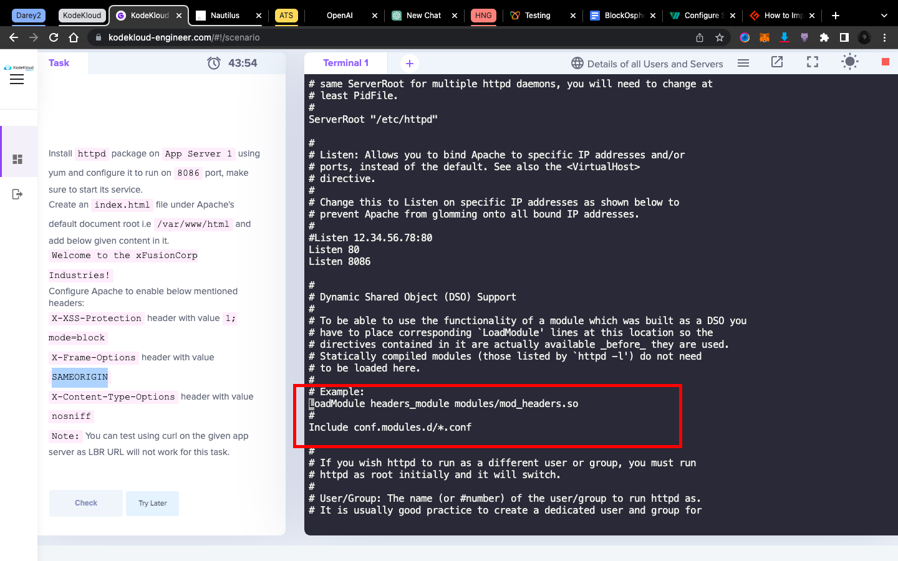

# TASK

We are working on hardening Apache web server on all app servers. As a part of this process we want to add some of the Apache response headers for security purpose. We are testing the settings one by one on all app servers. As per details mentioned below enable these headers for Apache:

Install `httpd` package on `App Server 1` using `yum` and configure it to run on `6300` port, make sure to start its service.

Create an `index.html` file under Apache's default document root i.e `/var/www/html` and add below given content in it.

`Welcome to the xFusionCorp Industries!`

Configure Apache to enable below mentioned headers:

`X-XSS-Protection` header with `value 1; mode=block`

`X-Frame-Options` header with value `SAMEORIGIN`

`X-Content-Type-Options` header with value `nosniff`

> Note: You can test using curl on the given app server as LBR URL will not work for this task.


# SOLUTION

```bash
ssh tony@stapp01

sudo yum install -y httpd

ls /etc/httpd/conf/

# add `Listen 6300` just right under the `Listen 80` line
sudo vi /etc/httpd/conf/httpd.conf
# viwe image 1 to see changes to be added to the configuration file

# start and enable the apache server
sudo systemctl start httpd
sudo systemctl enable httpd
sudo systemctl status httpd

# creat the index.html file
sudo vi /var/www/html/index.html

# test the index.html file
curl localhost:8086

# add the headers to the configuration file
sudo vi /etc/httpd/conf/httpd.conf
# view image to see the configuration added

# restart the server
sudo systemctl restart httpd
sudo systemctl status httpd
```





[For More Info and Explanations Click Here](https://geekflare.com/http-header-implementation/)
